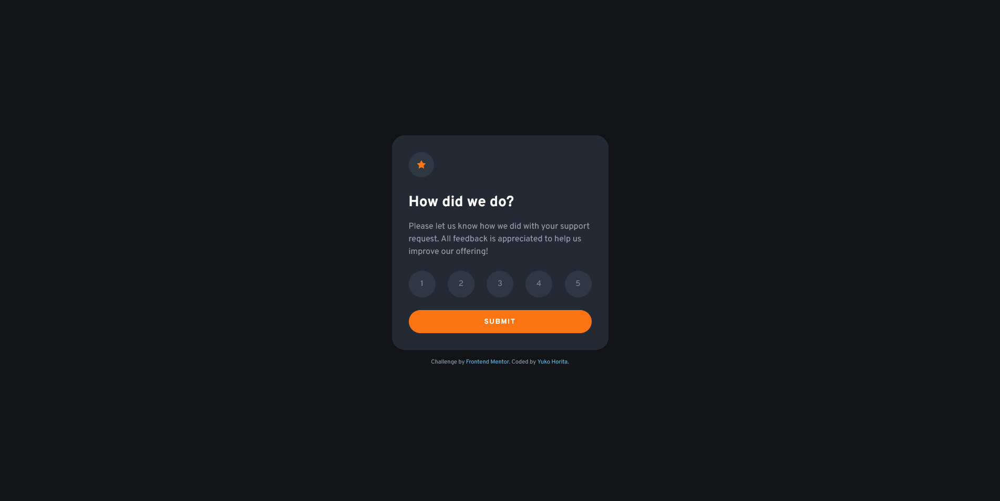

# Frontend Mentor - Interactive rating component solution

This is a solution to the [Interactive rating component challenge on Frontend Mentor](https://www.frontendmentor.io/challenges/interactive-rating-component-koxpeBUmI). Frontend Mentor challenges help you improve your coding skills by building realistic projects.

## Table of contents

- [Overview](#overview)
  - [The challenge](#the-challenge)
  - [Screenshot](#screenshot)
  - [Links](#links)
- [My process](#my-process)
  - [Built with](#built-with)
  - [What I learned](#what-i-learned)
  - [Continued development](#continued-development)
  - [Useful resources](#useful-resources)
- [Author](#author)

## Overview

### The challenge

Users should be able to:

- View the optimal layout for the app depending on their device's screen size
- See hover states for all interactive elements on the page
- Select and submit a number rating
- See the "Thank you" card state after submitting a rating

### Screenshot

### Links

- Solution URL: [https://www.frontendmentor.io/solutions/interactive-rating-component-remix-typescript-and-sassscss-S1xjfGvm9](https://www.frontendmentor.io/solutions/interactive-rating-component-remix-typescript-and-sassscss-S1xjfGvm9)
- Live Site URL: [https://interactive-rating-component-fem.vercel.app/](https://interactive-rating-component-fem.vercel.app/)

## My process

### Built with

- [Remix](https://remix.run/)
- Semantic HTML5 markup
- Sass/Scss
- Flexbox
- CSS Grid
- Mobile-first workflow

### What I learned

I've heard that handling requests on forms are easy on Remix, so I gave a go.
I liked the feature I can get the data using `useActionData` and I could use it in states and errors.
It is much easier than React that uses `on Change` handler and `useState` for the submitted data.

Regarding accessibility, I have learnt the use of `aria-describedby` for error message. I put it in radio input and `id` in the `
` tag of the error message.
I still want to know the best practice when I have multiple inputs. Maybe, I should have set fieldset and put it on the tag.

### Continued development

I should learn more on accessibility on form control. This was my first project using TypeScript, but there was not many places to use types, so I will practice more on other projects.

### Useful resources

- [Remix Single: Newsletter Signup Form](https://www.youtube.com/watch?v=jd_bin5HPrw&list=PLXoynULbYuEDG2wBFSZ66b85EIspy3fy6)
- [Describing aria-describedby](https://www.tpgi.com/describing-aria-describedby/)

## Author

- Website - [Yuko Horita](https://yukohorita-dev.vercel.app/)
- Frontend Mentor - [@Sloth247](https://www.frontendmentor.io/profile/Sloth247)
